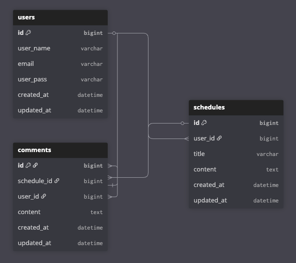

# API 명세서

---
# 일정 CRUD
## 📍일정 생성 (Create)
- Method: `POST`
- URL: `/schedules`

### Request Body
```
{
    "userId": 1,
    "title": "할일 제목",
    "content": "할일 내용",
}
```
### Response
```
{
    "id": 10,
    "userId": 1,
    "userName": "유저 이름",
    "title": "할일 제목",
    "content": "할일 내용",
    "createdAt": "작성일"
}
```

## 📍일정 조회 (Read)

### 전체 일정 조회 Response
- Method: `GET`
- URL: `/schedules`
```
[
    {
    "id": 작성ID1,
    "userId": 1,
    "userName": "유저 이름",
    "title": "할일 제목",
    "content": "할일 내용",
    "createdAt": "작성일",
    "updatedAt": "수정일"
    },
    {
    "id": 작성ID1,
    "userId": 1,
    "userName": "유저 이름",
    "title": "할일 제목",
    "content": "할일 내용",
    "createdAt": "작성일",
    "updatedAt": "수정일"
    }
}
```
### 선택 일정 조회 Response
- Method: `GET`
- URL: `/schedules/{scheduleId}`
```
{
    "id": 작성ID1,
    "userId": 1,
    "userName": "유저 이름",
    "title": "할일 제목",
    "content": "할일 내용",
    "createdAt": "작성일",
    "updatedAt": "수정일"
}
```

## 📍일정 수정 (Update)
- Method: `PUT`
- URL: `/schedules/{scheduleId}`
### Request Body
```
{
    "title": "할일 제목",
    "content": "할일 내용",
}
```
### Response
```
{
    "id": 작성id,
    "userId": 1,
    "userName": "유저 이름",
    "title": "할일 제목",
    "content": "할일 내용",
    "createdAt": "작성일",
    "updatedAt": "수정일"
}
```

## 📍일정 삭제 (Delete)
- Method: `DELETE`
- URL: `/schedules/{scheduleId}`
### Request Body
```
{
  "userId": 1,
  "userPass": "1234"
}
```
### Response
```
{
    "message": "일정 삭제 완료"
}
```

---

# 유저 CRUD
## 📍유저 생성 (Create)
- Method: `POST`
- URL: `/users`

### Request Body
```
{
    "userName": "유저명",
    "email": "이메일",
    "userPass": "비밀번호"
}
```
### Response
```
{
    "id": 1,
    "userName": "유저명",
    "email": "이메일",
    "createdAt": "생성일",
    "updatedAt": "수정일"
}
```

## 📍유저 조회 (Read)

### 전체 유저 조회 Response
- Method: `GET`
- URL: `/users`
```
[
    {
    "id": 1,
    "userName": "유저명",
    "email": "이메일",
    "createdAt": "생성일",
    "updatedAt": "수정일"
    },
    {
    "id": 2,
    "userName": "유저명",
    "email": "이메일",
    "createdAt": "생성일",
    "updatedAt": "수정일"
    }
}
```
### 선택 유저 조회 Response
- Method: `GET`
- URL: `/users/{userId}`
```
{
    "id": 1,
    "userName": "유저명",
    "email": "이메일",
    "createdAt": "생성일",
    "updatedAt": "수정일"
}
```

## 📍유저 수정 (Update)
- Method: `PUT`
- URL: `/users/{userId}`
### Request Body
```
{
    "userName": "유저명",
    "email": "이메일",
    "userPass": "비밀번호"
}
```
### Response
```
{
    "id": 1,
    "userName": "유저명",
    "email": "이메일",
    "createdAt": "생성일",
    "updatedAt": "수정일"
}
```

## 📍유저 삭제 (Delete)
- Method: `DELETE`
- URL: `/users/{userId}`
### Request Body
```
{
  "userPass": "1234"
}
```
### Response
```
{
    "message": "유저 삭제 완료"
}
```

---

# 댓글 CRUD
## 📍댓글 생성 (Create)
- Method: `POST`
- URL: `/schedules/{scheduleId}/comments?userId={userId}`
### Path Variable
이름 : scheduleId
타입 : Long
설명 : 댓글이 달릴 일정 ID
### Query Parameter
이름 : userId
타입 : Long
설명 : 댓글 작성자 ID
### Request Body
```
{
    "content": "댓글 내용"
}
```
### Response
```
{
    "id": 1,
    "content": "댓글 내용",
    "userId": 1,
    "scheduleId": 1,
    "createdAt": "2026-04-23T12:00:00"
}
```

## 📍댓글 조회 (Read)

### 전체 댓글 조회 Response
- Method: `GET`
- URL: `GET /schedules/{scheduleId}/comments`
```
[
    {
        "id": 1,
        "content": "댓글1",
        "userId": 1,
        "scheduleId": 1,
        "createdAt": "2026-04-23T12:00:00"
    },
    {
        "id": 2,
        "content": "댓글2",
        "userId": 2,
        "scheduleId": 1,
        "createdAt": "2026-04-23T12:10:00"
    }
]
```
### 선택 일정 조회 Response
- Method: `GET`
- URL: `GET /schedules/{scheduleId}/comments/{commentId}`
```
{
    "id": 1,
    "content": "댓글 내용",
    "userId": 1,
    "scheduleId": 1,
    "createdAt": "2026-04-23T12:00:00"
}
```

## 📍댓글 수정 (Update)
- Method: `PUT`
- URL: `/schedules/{scheduleId}/comments/{commentId}`
### Request Body
```
{
    "content": "수정된 댓글"
}
```
### Response
```
{
    "id": 1,
    "content": "수정된 댓글",
    "userId": 1,
    "scheduleId": 1,
    "modifiedAt": "2026-04-23T12:30:00"
}
```

## 📍댓글 삭제 (Delete)
- Method: `DELETE`
- URL: `/schedules/{scheduleId}/comments/{commentId}`
### Response
```
{
    "message": "댓글 삭제 완료"
}
```

---

# ERD

---
